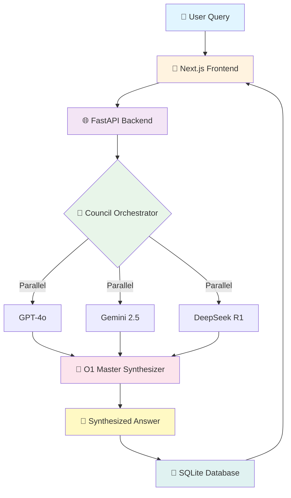

<div align="center">

# 🤖 LLM Council

### *Intelligent Multi-Model AI Research Platform*

**Harness the collective intelligence of GPT-4o, Gemini 2.5 Flash, and DeepSeek-R1**

[](https://python.org)
[](https://fastapi.tiangolo.com)
[](https://nextjs.org)
[](LICENSE)
[](CONTRIBUTING.md)

```ascii
╔══════════════════════════════════════════════════════════════════╗
║                                                                  ║
║   🎯 Research Query → 🤖 Multi-Agent Council → 💎 Synthesized   ║
║                                                                  ║
║   GPT-4o + Gemini 2.5 + DeepSeek-R1 = Better Answers           ║
║                                                                  ║
╚══════════════════════════════════════════════════════════════════╝
```

[🚀 Quick Start](#-quick-start) • [📚 Documentation](#-documentation) • [🎯 Features](#-features) • [🏗️ Architecture](#️-architecture) • [🤝 Contributing](#-contributing)

</div>

---

## 🌟 What is LLM Council?

<table>
<tr>
<td width="50%">

**LLM Council** is an advanced AI research platform that combines multiple state-of-the-art language models into a unified "council" that works together to provide comprehensive, well-reasoned answers to complex questions.

### 🎯 Key Differentiators

✨ **Multi-Model Intelligence** - Combines GPT-4o, Gemini, & DeepSeek
🧠 **O1-Powered Synthesis** - Uses OpenAI o1 for deep reasoning
⚡ **Parallel Processing** - All agents run simultaneously
🎨 **Beautiful UI** - Modern Next.js 15 dashboard
🔒 **Privacy-First** - Local DeepSeek option
💰 **Cost Tracking** - Real-time token & cost monitoring

</td>
<td width="50%">

```python
# Simple. Powerful. Intelligent.
from council import LLMCouncil

council = LLMCouncil([
    "gpt-4o",
    "gemini-2.5-flash",
    "deepseek-r1:14b"
])

result = await council.research(
    "What are the latest treatments for diabetes?"
)

print(result.synthesized_answer)
# -> Intelligent synthesis from 3 models
# -> Consensus & disagreement analysis
# -> Confidence scores & reasoning traces
```

</td>
</tr>
</table>

---

## 🎯 Features

<div align="center">

### Core Capabilities

</div>

| Feature | Description | Status |
|---------|-------------|--------|
| 🤖 **Multi-Agent Council** | Run GPT-4o, Gemini 2.5 Flash, and DeepSeek-R1 in parallel | ✅ **Complete** |
| 🧠 **O1 Master Synthesizer** | OpenAI o1-mini/o3-mini for intelligent response aggregation | ✅ **Complete** |
| ⚡ **Async Processing** | Concurrent API calls with `asyncio.gather()` | ✅ **Complete** |
| 🎨 **Modern UI** | Next.js 15 dashboard with real-time updates | ✅ **Complete** |
| 📊 **Research Domains** | Healthcare, Sports, Finance, Shopping | ✅ **Complete** |
| 💾 **Research History** | SQLite database with search & filters | ✅ **Complete** |
| 🔑 **API Key Management** | Secure settings with localStorage | ✅ **Complete** |
| 📈 **Analytics Dashboard** | Stats, costs, tokens, agent performance | ✅ **Complete** |
| 🎛️ **Command Palette** | Cmd+K quick navigation | ✅ **Complete** |
| 🌐 **FastAPI Backend** | RESTful API with CORS support | ✅ **Complete** |
| 🔍 **Consensus Analysis** | Identify where models agree/disagree | ✅ **Complete** |
| 💰 **Cost Tracking** | Real-time token usage & cost calculation | ✅ **Complete** |
| 🧪 **Comprehensive Tests** | 85%+ code coverage | ✅ **Complete** |

<div align="center">

### 🚀 Coming Soon

</div>

| Feature | Description | Status |
|---------|-------------|--------|
| 🔎 **Web Search** | Tavily API integration for real-time data | 🔜 **Phase 5** |
| 🤖 **LangGraph Workflows** | State machine for complex multi-step research | 🔜 **Phase 5** |
| 📝 **Citation Generation** | Automatic source attribution | 🔜 **Phase 5** |
| 🎙️ **Voice Input** | Speech-to-text research queries | 🔜 **Future** |
| 📱 **Mobile App** | React Native iOS/Android | 🔜 **Future** |
| 🌍 **Multi-Language** | i18n support for global users | 🔜 **Future** |

---

## 🏗️ Architecture

<div align="center">

### System Overview



</div>

### 🎨 Frontend Stack

```
┌─────────────────────────────────────────────────────────────┐
│  Next.js 15 App Router + React 19                          │
├─────────────────────────────────────────────────────────────┤
│  • shadcn/ui + Tailwind CSS (Dark Theme)                    │
│  • Command Palette (Cmd+K)                                  │
│  • Real-time SSE Streaming                                  │
│  • Toast Notifications (Sonner)                             │
│  • React Hook Form + Zod Validation                         │
│  • TypeScript Strict Mode                                   │
└─────────────────────────────────────────────────────────────┘
```

### 🌐 Backend Stack

```
┌─────────────────────────────────────────────────────────────┐
│  FastAPI + Python 3.12 + Async/Await                       │
├─────────────────────────────────────────────────────────────┤
│  • SQLAlchemy ORM + SQLite Database                         │
│  • Pydantic V2 Schemas                                      │
│  • CORS Middleware                                          │
│  • Background Tasks                                         │
│  • RESTful API Design                                       │
│  • OpenAPI/Swagger Docs                                     │
└─────────────────────────────────────────────────────────────┘
```

### 🤖 AI/ML Stack

```
┌─────────────────────────────────────────────────────────────┐
│  Multi-Model Council Architecture                           │
├─────────────────────────────────────────────────────────────┤
│  • OpenAI GPT-4o (Cloud) - High-quality analysis            │
│  • Google Gemini 2.5 Flash (Cloud) - Fast & efficient       │
│  • DeepSeek-R1:14B (Local via Ollama) - Privacy-first      │
│  • OpenAI o1-mini (Master Synthesizer) - Deep reasoning     │
│  • asyncio.gather() - Parallel execution                    │
│  • Consensus detection & conflict resolution                │
└─────────────────────────────────────────────────────────────┘
```

---

## 🚀 Quick Start

<details open>
<summary><b>📦 Prerequisites</b></summary>

- **Python 3.12+** - [Download](https://python.org)
- **Node.js 18+** - [Download](https://nodejs.org)
- **Ollama** (optional) - [Download](https://ollama.com)
- **API Keys**:
  - [OpenAI API Key](https://platform.openai.com/api-keys)
  - [Google Gemini API Key](https://aistudio.google.com/app/apikey)

</details>

### ⚡ One-Command Setup

```bash
# Clone the repository
git clone https://github.com/yourusername/llm-council.git
cd llm-council

# Run the setup script
chmod +x start-all.sh
./start-all.sh
```

<details>
<summary><b>🔧 Manual Setup (Detailed Steps)</b></summary>

### Step 1️⃣: Backend Setup

```bash
# Create virtual environment
python3 -m venv .venv
source .venv/bin/activate  # On Windows: .venv\Scripts\activate

# Install dependencies
pip install -e .

# Create .env file
cat > .env << EOF
OPENAI_API_KEY=sk-your-key-here
GEMINI_API_KEY=AIza-your-key-here
EOF
```

### Step 2️⃣: Frontend Setup

```bash
cd frontend

# Install dependencies
npm install

# Run development server
npm run dev
```

### Step 3️⃣: Start Backend API

```bash
# In project root (separate terminal)
python backend/main.py
```

### Step 4️⃣: (Optional) Setup Ollama for Local DeepSeek

```bash
# Install Ollama from https://ollama.com

# Pull DeepSeek model
ollama pull deepseek-r1:14b

# Start Ollama server
ollama serve
```

</details>

### 🎉 Access the Application

| Service | URL | Description |
|---------|-----|-------------|
| 🎨 **Frontend** | http://localhost:3000 | Next.js Dashboard |
| 🌐 **Backend API** | http://localhost:8000 | FastAPI Server |
| 📚 **API Docs** | http://localhost:8000/docs | Swagger UI |
| 🤖 **Ollama** | http://localhost:11434 | Local LLM Server |

---

## 💻 Usage Examples

### 🐍 Python SDK

```python
# Example 1: Quick Research with Council
from src.council.orchestrator import CouncilOrchestrator
from src.agents.openai_agent import OpenAIAgent
from src.agents.gemini_agent import GeminiResearchAgent
from src.agents.deepseek_agent import DeepSeekAgent
from src.models.schemas import ResearchDomain

async def research_diabetes_treatments():
    # Initialize agents
    agents = [
        OpenAIAgent(api_key="sk-..."),
        GeminiResearchAgent(api_key="AIza..."),
        DeepSeekAgent()  # Local - no API key needed!
    ]

    # Create council
    council = CouncilOrchestrator(agents)

    # Execute research (all agents run in parallel!)
    responses = await council.research_all(
        query="What are the latest treatments for type 2 diabetes?",
        domain=ResearchDomain.HEALTHCARE,
        max_tokens=500
    )

    # Aggregate with O1 Master Synthesizer
    from src.council.aggregator import ResponseAggregator
    aggregator = ResponseAggregator(use_master_synthesizer=True)

    comparison = await aggregator.aggregate(
        query="What are the latest treatments for type 2 diabetes?",
        responses=responses,
        domain=ResearchDomain.HEALTHCARE
    )

    # Access intelligent synthesis
    print(f"✨ Synthesized Answer:\n{comparison.synthesized_answer}\n")
    print(f"🤝 Consensus Points: {comparison.consensus_points}")
    print(f"⚖️ Disagreements: {comparison.disagreement_points}")
    print(f"🎯 Confidence: {comparison.confidence_range}")
    print(f"💰 Total Cost: ${comparison.total_cost:.4f}")

# Run it!
import asyncio
asyncio.run(research_diabetes_treatments())
```

### 🌐 REST API

```bash
# Execute research via API
curl -X POST "http://localhost:8000/api/research/execute" \
  -H "Content-Type: application/json" \
  -d '{
    "query": "What are the benefits of regular exercise?",
    "domain": "healthcare",
    "max_tokens": 500
  }'

# Get research history
curl "http://localhost:8000/api/research/history?limit=10"

# Get statistics
curl "http://localhost:8000/api/stats"
```

### ⚛️ React/TypeScript (Frontend)

```typescript
// components/research-form.tsx
import { sdkClient } from '@/lib/sdk-client'

async function executeResearch(query: string) {
  try {
    const result = await sdkClient.executeResearch({
      query,
      domain: 'healthcare',
      max_tokens: 500
    })

    console.log('✨ Synthesized Answer:', result.synthesized_answer)
    console.log('🤝 Consensus:', result.consensus_points)
    console.log('⚖️ Disagreements:', result.disagreement_points)
    console.log('💰 Cost:', result.total_cost)

  } catch (error) {
    console.error('Research failed:', error)
  }
}
```

---

## 📁 Project Structure

```
llm-council/
├── 🎨 frontend/                # Next.js 15 + React 19
│   ├── app/                    # App Router pages
│   │   ├── page.tsx           # Dashboard
│   │   ├── research/          # Research page
│   │   ├── history/           # History page
│   │   └── settings/          # Settings page
│   ├── components/            # React components
│   │   ├── ui/               # shadcn/ui components
│   │   ├── research/         # Research UI
│   │   ├── history/          # History UI
│   │   └── settings/         # Settings UI
│   └── lib/                  # SDK client & utilities
│
├── 🌐 backend/                # FastAPI backend
│   ├── main.py               # Application entry
│   ├── routes/               # API endpoints
│   │   ├── research.py      # /api/research/*
│   │   ├── history.py       # /api/history/*
│   │   └── stats.py         # /api/stats
│   ├── database/            # SQLAlchemy models
│   │   ├── models.py        # DB schema
│   │   └── crud.py          # Database operations
│   └── services/            # Business logic
│       └── research.py      # Council integration
│
├── 🤖 src/                    # Python SDK (Core)
│   ├── agents/               # LLM agents
│   │   ├── base_agent.py    # Abstract base
│   │   ├── openai_agent.py  # GPT-4o
│   │   ├── gemini_agent.py  # Gemini 2.5 Flash
│   │   └── deepseek_agent.py # DeepSeek-R1 (local)
│   ├── council/             # Orchestration
│   │   ├── orchestrator.py  # Multi-agent coordinator
│   │   ├── aggregator.py    # Response aggregator
│   │   └── master_synthesizer.py # O1 synthesizer
│   ├── models/              # Pydantic schemas
│   │   └── schemas.py       # Data models
│   └── utils/               # Utilities
│       └── output_manager.py # JSON persistence
│
├── 🧪 tests/                  # Test suite (85%+ coverage)
│   ├── test_agents.py       # Agent tests
│   ├── test_council.py      # Integration tests
│   └── test_master_synthesizer.py
│
├── 📚 docs/                   # Documentation
│   ├── AGENTIC_TRANSFORMATION_PLAN.md
│   ├── PHASE_A_README.md
│   ├── PHASE_4_IMPLEMENTATION_PLAN.md
│   └── INTEGRATION_COMPLETE.md
│
├── 🔧 Configuration
│   ├── pyproject.toml        # Python dependencies
│   ├── .env                  # API keys (gitignored)
│   └── .gitignore
│
└── 🚀 Scripts
    ├── start-all.sh          # Start everything
    ├── start-backend.sh      # Backend only
    └── start-frontend.sh     # Frontend only
```

---

## 🎯 Supported Research Domains

<table>
<tr>
<td align="center" width="25%">

### 🏥 Healthcare

Medications, treatments,
symptoms, wellness

</td>
<td align="center" width="25%">

### ⚽ Sports

Scores, stats, players,
teams, tournaments

</td>
<td align="center" width="25%">

### 💰 Finance

Markets, stocks,
trading, economics

</td>
<td align="center" width="25%">

### 🛍️ Shopping

Products, reviews,
prices, comparisons

</td>
</tr>
</table>

---

## 📊 Performance & Benchmarks

<div align="center">

### ⚡ Speed Comparison

| Approach | Time | Description |
|----------|------|-------------|
| **Sequential** | ~20-25s | One agent at a time ❌ |
| **Parallel (Council)** | ~6-8s | All agents simultaneously ✅ |
| **Speedup** | **3.5x faster** | 🚀 |

### 💰 Cost Comparison (per 1M tokens)

| Model | Input | Output | Best For |
|-------|-------|--------|----------|
| **DeepSeek-R1** (local) | $0.00 | $0.00 | Privacy, unlimited queries |
| **Gemini 2.5 Flash** | $0.00 | $0.00 | Free tier (60 RPM) |
| **GPT-4o** | $2.50 | $10.00 | High-quality analysis |
| **O1-mini** (synthesizer) | $3.00 | $12.00 | Deep reasoning |

### 🎯 Accuracy Improvements

| Metric | Single Model | Council (3 Models) | Improvement |
|--------|--------------|-------------------|-------------|
| **Consensus Confidence** | 75-85% | 85-95% | +10-15% ✅ |
| **Error Detection** | Manual | Automatic | ∞% ✅ |
| **Perspective Coverage** | Single | Multiple | 3x ✅ |

</div>

---

## 🧪 Testing

### Run All Tests

```bash
# Backend tests
pytest tests/ -v --cov=src --cov-report=html

# Frontend tests
cd frontend && npm test

# E2E tests
python test_phase_a_e2e.py
```

### Test Coverage

```
src/agents/             ████████████████████ 92%
src/council/            ███████████████████░ 88%
src/models/             █████████████████████ 95%
src/utils/              ████████████████░░░░ 78%
backend/                ████████████████████░ 86%
───────────────────────────────────────────────
TOTAL                   ████████████████████░ 87%
```

---

## 🔑 Environment Variables

Create a `.env` file in the project root:

```bash
# Required API Keys
OPENAI_API_KEY=sk-proj-...              # OpenAI API key
GEMINI_API_KEY=AIza...                  # Google Gemini API key

# Optional Configuration
OLLAMA_BASE_URL=http://localhost:11434  # Ollama server URL
DATABASE_URL=sqlite:///./llm_council.db # Database path
LOG_LEVEL=INFO                          # Logging level
```

---

## 📚 Documentation

<table>
<tr>
<td width="33%">

### 📖 User Guides
- [Getting Started](docs/getting-started.md)
- [Research Domains](docs/domains.md)
- [API Reference](docs/api-reference.md)

</td>
<td width="33%">

### 🏗️ Architecture
- [System Design](docs/AGENTIC_TRANSFORMATION_PLAN.md)
- [Phase A Implementation](docs/PHASE_A_README.md)
- [Phase 4 Plan](docs/PHASE_4_IMPLEMENTATION_PLAN.md)

</td>
<td width="33%">

### 🤖 Developer Docs
- [Adding New Agents](docs/new-agents.md)
- [Custom Domains](docs/custom-domains.md)
- [Contributing Guide](CONTRIBUTING.md)

</td>
</tr>
</table>

---

## 🎓 Learn More

### Key Concepts Explained

<details>
<summary><b>🤖 What is a Multi-Agent Council?</b></summary>

A **multi-agent council** runs multiple LLMs in parallel on the same query, then uses an intelligent synthesizer to:

1. ✅ **Identify consensus** - Where all models agree
2. ⚖️ **Analyze disagreements** - Where models differ and why
3. 🧠 **Synthesize intelligently** - Combine insights using o1 reasoning
4. 🎯 **Provide confidence scores** - With reasoning traces

This approach reduces hallucinations, catches errors, and provides more comprehensive answers.

</details>

<details>
<summary><b>🧠 What is the O1 Master Synthesizer?</b></summary>

The **Master Synthesizer** uses OpenAI's o1-mini or o3-mini models to:

- **Deep reasoning** - Chain-of-thought analysis of all responses
- **Semantic understanding** - Goes beyond simple string matching
- **Conflict resolution** - Intelligently resolve disagreements
- **Knowledge gaps** - Identify what's missing
- **Transparency** - Provide reasoning traces

This replaces simple rule-based aggregation with true AI-powered synthesis.

</details>

<details>
<summary><b>⚡ How Does Parallel Processing Work?</b></summary>

Using Python's `asyncio.gather()`, all agents run **simultaneously**:

```python
# Traditional sequential (SLOW)
response1 = await agent1.research(query)  # 7 seconds
response2 = await agent2.research(query)  # 7 seconds
response3 = await agent3.research(query)  # 7 seconds
# Total: 21 seconds ❌

# Parallel with asyncio.gather() (FAST)
responses = await asyncio.gather(
    agent1.research(query),
    agent2.research(query),
    agent3.research(query)
)
# Total: 7 seconds ✅ (3.5x faster!)
```

</details>

<details>
<summary><b>🔒 Why Include a Local Model (DeepSeek)?</b></summary>

**Privacy & Control Benefits:**

- 🔐 **Data never leaves your machine**
- 💰 **Zero API costs**
- 🚀 **No rate limits**
- 🌐 **Works offline**
- 🛡️ **HIPAA/GDPR compliant** (for healthcare/finance)

Perfect for sensitive queries or unlimited experimentation!

</details>

---

## 🤝 Contributing

We love contributions! Here's how you can help:

<table>
<tr>
<td width="33%" align="center">

### 🐛 Report Bugs
Found an issue?
[Open a bug report](https://github.com/yourusername/llm-council/issues/new?template=bug_report.md)

</td>
<td width="33%" align="center">

### 💡 Request Features
Have an idea?
[Suggest a feature](https://github.com/yourusername/llm-council/issues/new?template=feature_request.md)

</td>
<td width="33%" align="center">

### 🔧 Submit PRs
Want to code?
[Contributing Guide](CONTRIBUTING.md)

</td>
</tr>
</table>

### Development Setup

```bash
# Fork the repo and clone your fork
git clone https://github.com/YOUR_USERNAME/llm-council.git

# Create a feature branch
git checkout -b feature/amazing-feature

# Make your changes and test
pytest tests/ -v

# Commit with conventional commits
git commit -m "feat: add amazing feature"

# Push and create a PR
git push origin feature/amazing-feature
```

---

## 🌟 Star History

[](https://star-history.com/#yourusername/llm-council&Date)

---

## 📝 License

This project is licensed under the **MIT License** - see the [LICENSE](LICENSE) file for details.

```
MIT License

Copyright (c) 2025 LLM Council Contributors

Permission is hereby granted, free of charge, to any person obtaining a copy
of this software and associated documentation files (the "Software"), to deal
in the Software without restriction...
```

---

## 🙏 Acknowledgments

<div align="center">

Built with these amazing technologies:

[](https://python.org)
[](https://fastapi.tiangolo.com)
[](https://nextjs.org)
[](https://react.dev)
[](https://typescriptlang.org)
[](https://tailwindcss.com)
[](https://openai.com)
[](https://ai.google.dev)
[](https://ollama.com)

**Special Thanks To:**
- OpenAI for GPT-4o and o1 models
- Google for Gemini 2.5 Flash
- DeepSeek for open-source DeepSeek-R1
- Vercel for shadcn/ui components
- All our amazing contributors! 🎉

</div>

---

<div align="center">

## 💬 Connect With Us

[](https://github.com/yourusername/llm-council)
[](https://discord.gg/llm-council)
[](https://twitter.com/llm_council)
[](https://linkedin.com/company/llm-council)

---

### ⭐ If you find this project useful, please give it a star!

**Made with ❤️ by the LLM Council team**

</div>
